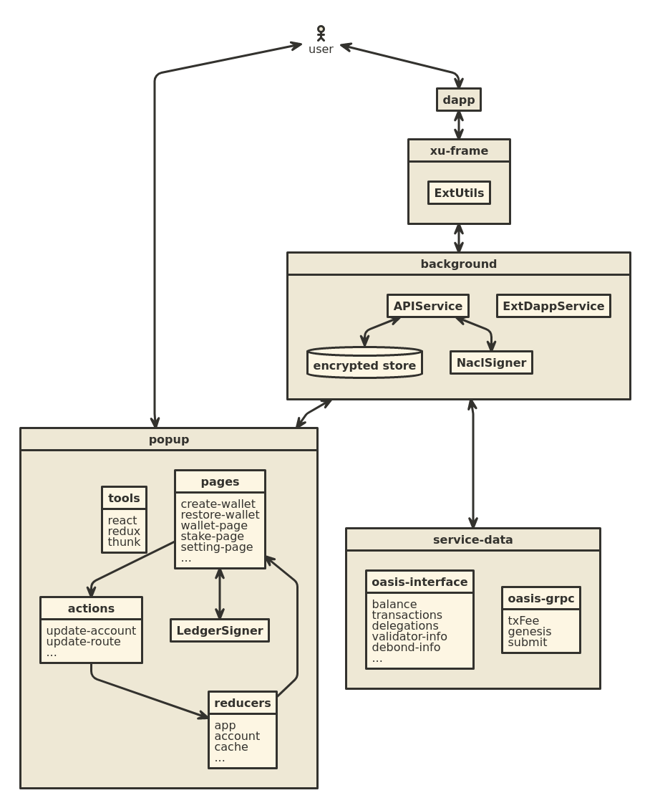

# ROSE Wallet - Browser Extension

[![CI lint status][github-ci-lint-badge]][github-ci-lint-link]

[github-ci-lint-badge]: https://github.com/oasisprotocol/oasis-wallet-ext/workflows/ci-lint/badge.svg
[github-ci-lint-link]: https://github.com/oasisprotocol/oasis-wallet-ext/actions?query=workflow:ci-lint+branch:master

The official non-custodial browser extension wallet for the [Oasis Network].

[Oasis Network]: https://docs.oasis.io/general/oasis-network/

## Introduction

ROSE Wallet - Browser Extension provides a complete solution for managing your
ROSE tokens, including everything for convenient staking of your ROSE tokens.

## Features

### Wallet and Accounts

- Create/Restore wallets using standard [BIP-0039] mnemonic phrases
- Multiple accounts within the same wallet
- Import accounts from your [Ledger] hardware wallet
- Import accounts directly from their private keys
- Watch 3rd-party accounts
- Address book of your saved accounts
- Easily switch between different Oasis wallets that use the same [ADR 0008]
  standard account key generation process.

### Transactions

- Send tokens
- Delegate/Undelegate tokens
- View transaction history
- View staking/delegation
- Connect your wallet to dApps and sign their transactions.

### Accessibility

- Available in multiple languages (currently, English and Chinese)

[BIP-0039]: https://github.com/bitcoin/bips/blob/master/bip-0039.mediawiki
[Ledger]: https://www.ledger.com/
[ADR 0008]:
  https://github.com/oasisprotocol/oasis-core/blob/master/docs/adr/0008-standard-account-key-generation.md

## Architecture

The extension is roughly laid out this way:

- background - the extension's background page
    - APIService (wallet info storage, in-memory transaction signing, transaction submission)
    - ExtDAppService (DApp interface, handles requests from xu-frame)

- service-data - connections to the network and block explorer
    - OASISSCAN (provided by [oasisscan](https://api.oasisscan.com/mainnet))
    - Oasis gRPC-web (provided by [oasisscan-grpc](https://grpc-mainnet.oasisscan.com))

- popup - interactive parts
    - pages (UI, Ledger transaction signing)
    - actions (reducer action)
    - reducer

- xu-frame - a page that DApps can load in an iframe to communicate with this extension
    - code for this page is in background/ExtUtils.js
    - Oasis SDK ext-utils handlers

[][1]


## Getting started

### build extension

ROSE Wallet extension repo uses git-secret to encrypt the endpoints and the api keys. So, you can't build this without creating your own config file. You should create your own `config.js` file in the folder. Refer to the `config.example.js` sample file to create your own configuration.

```sh
yarn install
yarn dev
```

### Install and running extension

Extension's build output is placed in `/dist`, and you can check out [this page](https://developer.chrome.com/extensions/getstarted) for installing the developing extension.


### dapp-connect test

* open [oasis-test-dapp](https://lukaw3d.github.io/oasis-test-dapp)
* click connect and other button to communicate with wallet

## CI pipelines (Coming soon)

```sh
yarn install --frozen-lockfile
yarn test
yarn buildProd
```

## Preparing a Production Release Build

```sh
VERSION=`cat public/manifest.json | jq .version -r`
COMMIT=`git rev-parse --short HEAD`
rm -rf dist/
yarn install --frozen-lockfile
yarn buildProd
zip -r rose-wallet-$VERSION-$COMMIT.zip dist/
```

If you're actually making a new release, follow the applicable steps in the
[release process doc](docs/release-process.md)

## LICENSE

[Apache License 2.0](LICENSE)

[1]:https://www.nomnoml.com/#view/%5B%3Cactor%3Euser%5D%0A%0A%5Bbackground%7C%0A%09%5BAPIService%5D%20%3C-%3E%20%5B%3Cdatabase%3Eencrypted%20store%5D%0A%20%20%20%20%5BAPIService%5D%20%3C-%3E%20%5BNaclSigner%5D%0A%09%5BExtDappService%5D%0A%5D%0A%0A%5Bbackground%5D%20%3C-%3E%20%5Bpopup%5D%0A%0A%5Bpopup%7C%0A%20%20%20%5Btools%7C%0A%20%20%20%20%20react%0A%20%20%20%20%20redux%0A%20%20%20%20%20thunk%0A%20%20%20%5D%0A%20%20%20%5Bpages%7C%0A%20%20%20%20%20create-wallet%0A%20%20%20%20%20restore-wallet%0A%20%20%20%20%20wallet-page%0A%20%20%20%20%20stake-page%0A%20%20%20%20%20setting-page%0A%20%20%20%20%20...%0A%20%20%20%5D%0A%20%20%20%5Bpages%5D%20%3C-%3E%20%5BLedgerSigner%5D%0A%20%20%20%5Breducers%7C%0A%20%20%20%20%20app%0A%20%20%20%20%20account%0A%20%20%20%20%20cache%0A%20%20%20%20%20...%0A%20%20%20%5D%0A%20%20%20%5Bactions%7C%0A%20%20%20%20%20update-account%0A%20%20%20%20%20update-route%0A%20%20%20%20%20...%0A%20%20%20%5D%0A%20%20%20%5Bpages%5D%3A-%3E%5Bactions%5D%0A%20%20%20%5Bactions%5D%3A-%3E%5Breducers%5D%0A%20%20%20%5Breducers%5D%3A-%3E%5Bpages%5D%0A%5D%0A%5Buser%5D%3C-%3E%5Bpopup%5D%0A%0A%5Bservice-data%20%7C%0A%20%20%5Boasis-interface%20%7C%0A%20%20%20%20balance%0A%20%20%20%09transactions%0A%20%20%20%20delegations%0A%20%20%20%09validator-info%0A%20%20%20%20debond-info%0A%20%20%20%20...%0A%20%20%5D%0A%20%20%5Boasis-grpc%20%7C%0A%20%20%09txFee%0A%20%20%20%20genesis%0A%20%20%20%20submit%0A%20%20%5D%0A%5D%0A%0A%5Bbackground%5D%3C-%3E%5Bservice-data%5D%0A%0A%5Bxu-frame%7C%0A%20%20%20%20%5BExtUtils%5D%0A%5D%0A%5Buser%5D%20%3C-%3E%20%5Bdapp%5D%0A%5Bdapp%5D%20%3C-%3E%20%5Bxu-frame%5D%0A%5Bxu-frame%5D%20%3C-%3E%20%5Bbackground%5D%0A%0A%0A%0A%0A%0A
